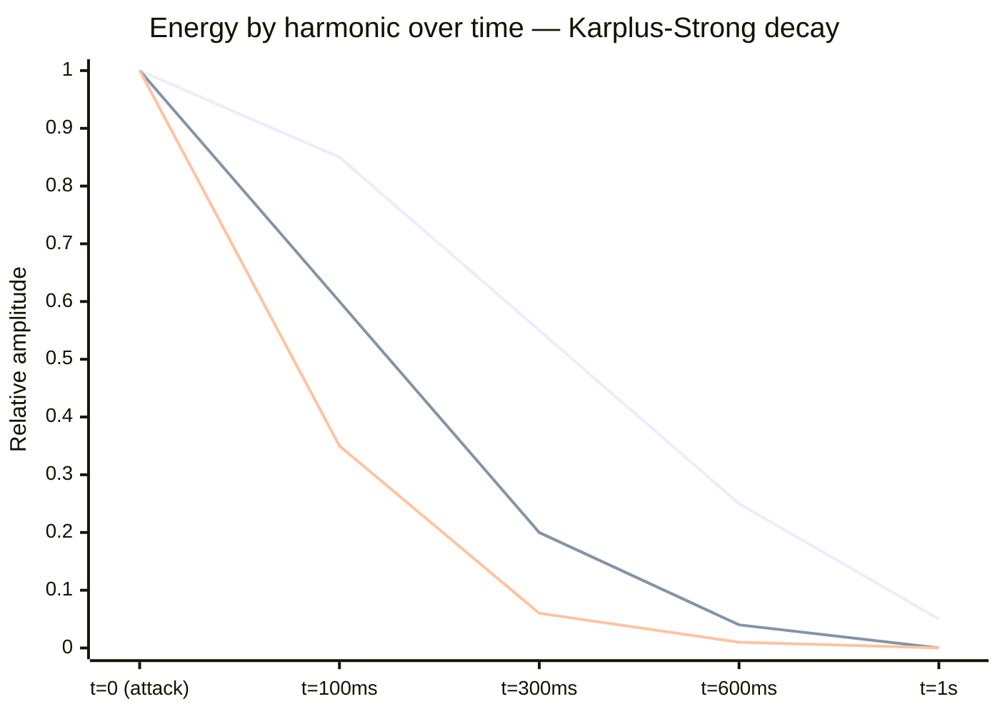
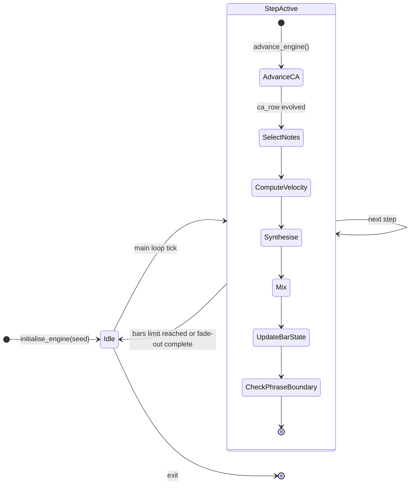
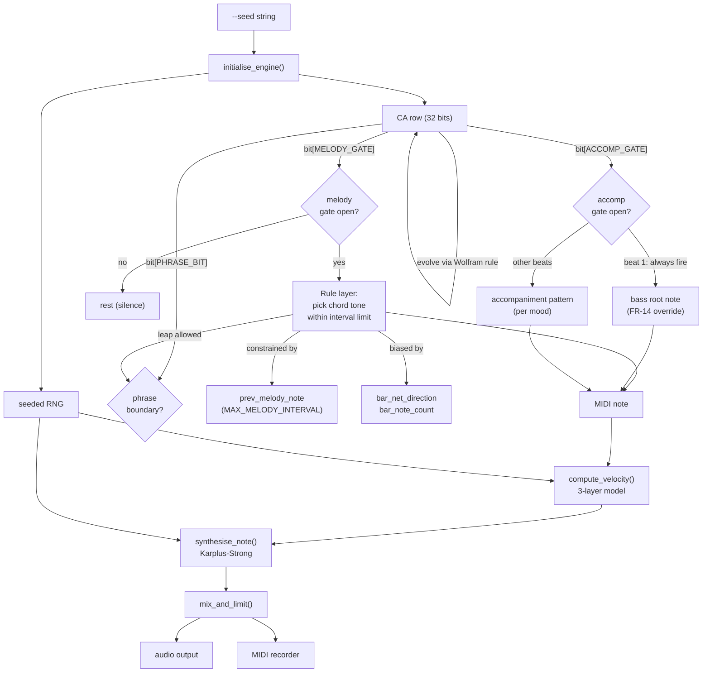
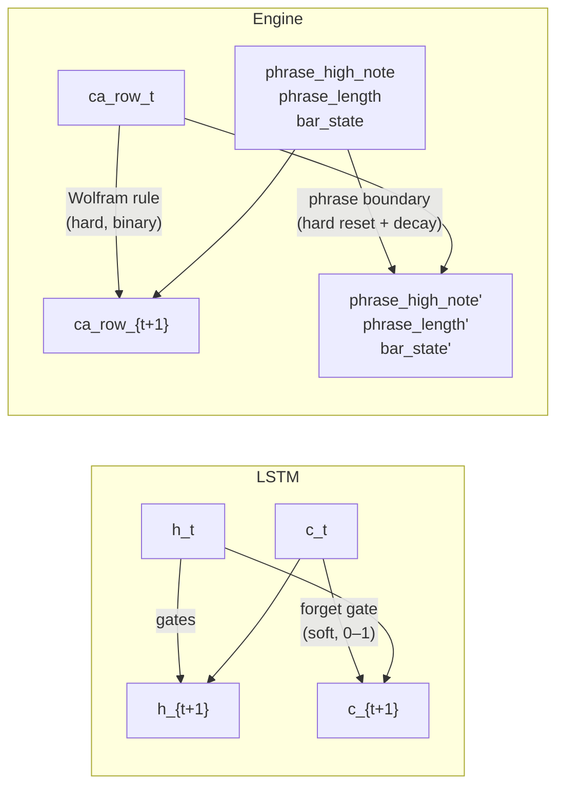

# PianoStream

## Changelog

| Date | Change | Triggered by |
| --- | --- | --- |
| 2026-07-07 | Initial draft | Session 1 |
| 2026-07-08 | Resolve all TBD items; fix FR-11, FR-7, `compute_velocity`, buffer model, DJ discovery | Session 2 |
| 2026-07-08 | Consistency audit fixes: FR-13 wording, `synthesise_note` rng param, `EngineState` concrete definition, RST docstrings in §3.5, add `ATTACK_SCALE`/`REST_PROBABILITY`/`PHRASE_SHORT`/`PHRASE_LONG` constants, add `logging`/`dataclasses` to §3.6 | Session 3 |
| 2026-07-08 | Add §2.12 engine architecture: state machine diagram, CA/rule flowchart, LSTM comparison table and diagram, three-timescale gantt; add bar-level state (`bar_note_count`, `bar_net_direction`) and soft phrase reset; add `BAR_DIRECTION_DESCENT_THRESHOLD`, `BAR_SPARSE_THRESHOLD` constants | Session 4 |

---

## 1. Requirements

### 1.1 Business / Product Requirements

| ID | Requirement |
| --- | --- |
| BR-1 | The script must produce music that sounds like a grand piano playing well-composed music — not a synthesiser approximation — to a listener who does not know it is procedurally generated. |
| BR-2 | The music must be DMCA-safe: generated entirely from mathematics with no sampled or pre-recorded audio. |
| BR-3 | The music must be suitable as stream background music for a live-coding session: non-irritating, continuously evolving, and listenable for at least 30 minutes without fatigue. |
| BR-4 | The script must export standard MIDI files usable in a Turbo Pascal 7 DOS game without post-processing. |
| BR-5 | The script must be compatible with `stream_dj.py` crossfade infrastructure so it can participate in a multi-genre DJ playlist alongside `ca_synth.py`. |

### 1.2 Functional Requirements

| ID | Requirement |
| --- | --- |
| FR-1 | The script SHALL synthesise piano audio in real time and stream it to the default audio output device. |
| FR-2 | The script SHALL generate music that never exactly repeats, driven by a deterministic seed so the same seed always produces the same output. |
| FR-3 | The script SHALL support a `--mood` parameter selecting the harmonic character of the music from a fixed set of named moods, each defining a chord progression. |
| FR-4 | The script SHALL support a `--bpm` parameter controlling the tempo in beats per minute. |
| FR-5 | The script SHALL support a `--seed` parameter accepting a text string that deterministically initialises the generative engine. |
| FR-6 | The script SHALL support a `--volume` parameter controlling the master output level (0.0 to 1.0). |
| FR-7 | The script SHALL support a `--bars` parameter. When N > 0, after N bars of music have been generated the script triggers the standard 4-bar fade-out (same mechanism as FR-10), then exits and saves the MIDI file if `--out_midi` is set. Total wall-clock runtime is therefore N + `FADE_OUT_BARS` bars. When `--bars` is 0 the script runs indefinitely. |
| FR-8 | The script SHALL support a `--out_midi` parameter specifying a file path to which a MIDI file is written on exit. |
| FR-9 | The script SHALL support a `--fade_in` parameter specifying the number of bars over which the master volume fades from 0 to full on startup, for use by the DJ crossfade system. |
| FR-10 | The script SHALL respond to a `fade_<pid>.flag` file written by the DJ script by triggering a graceful fade-out and clean exit, compatible with `stream_dj.py` IPC protocol. |
| FR-11 | The script SHALL display a terminal visualiser once per bar showing the current chord, active voices, and a representation of the generative state. Output per step would flood the terminal; bar-level granularity is sufficient for monitoring. |
| FR-12 | The script SHALL generate a left-hand accompaniment part and a right-hand melody part, kept in separate pitch registers, mixed into a single mono or stereo audio stream. |
| FR-13 | The melody voice SHALL move predominantly by conjunct motion, with consecutive notes no more than a perfect fifth (7 semitones, `MAX_MELODY_INTERVAL`) apart. Larger leaps up to one octave are permitted at phrase boundaries only, and must be resolved by stepwise contrary motion on the following note. |
| FR-14 | The bass / accompaniment voice SHALL place at least one note per bar on the downbeat, in a register at least one octave below the melody. |
| FR-15 | The script SHALL apply dynamic variation: individual notes SHALL vary in velocity (loudness) to avoid a mechanical, uniform sound. |
| FR-16 | The MIDI export SHALL assign General MIDI program 0 (Acoustic Grand Piano) to all melodic and bass channels via a program-change message at the start of each channel. |
| FR-17 | The MIDI export SHALL use note velocity values derived from the musical engine (not a fixed constant) on every note event. |
| FR-18 | The MIDI export SHALL emit clean note-off messages so notes do not hang when imported into a DAW or DOS playback library. |

### 1.3 Non-Functional Requirements

| ID | Requirement |
| --- | --- |
| NFR-1 | The script must run on Python 3.10 or later with no dependencies beyond `numpy`, `sounddevice`, and `midiutil`. |
| NFR-2 | Audio output latency must not cause audible glitches on a modern laptop under normal load. The per-step audio buffer must be written to the output stream synchronously (blocking write), matching the approach in `ca_synth.py`. |
| NFR-3 | The script must accept the same `--fade_in` / flag-file IPC protocol as `ca_synth.py` so that `stream_dj.py` can manage it without modification. |
| NFR-4 | CPU usage during normal playback must not prevent the host machine from running a coding session and screen-capture simultaneously. |
| NFR-5 | The MIDI export must be importable into GarageBand, Ableton Live, and standard MIDI sequencers without errors. |
| NFR-6 | The script must produce a terminal visualiser output that is legible at 80 columns, consistent with the project's 80-character line-length standard. |
| NFR-7 | The piano synthesis must produce a recognisable piano timbre: a percussive attack transient, harmonic overtone content, and an exponential decay — not a sustained tone. |

### 1.4 Constraints & Assumptions

- The script targets a single output file: `utils/piano-stream/piano_stream.py`.
- The script is a utility, not part of the game source. Pascal coding standards do not apply. Python 3.10+ conventions apply.
- The DJ compatibility constraint (NFR-3) is non-negotiable: the flag-file IPC and `--fade_in` argument must work exactly as in `ca_synth.py`.
- **MIDI target hardware:** General MIDI — see [ADR-U-0001](decisions/ADR-U-0001-midi-target.md).
- **Piano synthesis approach:** Karplus-Strong physical modelling — see [ADR-U-0002](decisions/ADR-U-0002-synthesis-approach.md).
- **Composition model:** CA-gated rule-based hybrid — see [ADR-U-0003](decisions/ADR-U-0003-composition-model.md).
- **Mood set:** The named moods and their chord progressions are not yet defined. They will be listed in §2.3 once the composition model (ADR-U-0003) is settled, as the chord voicings depend on the voice-leading approach.
- **Stereo vs mono:** The `ca_synth.py` baseline is mono. Whether the piano output is mono or stereo is an open question. Stereo panning of melody vs. accompaniment is a significant quality improvement but adds output channel complexity. This will be decided during Phase 1 requirements authoring and reflected in §3.
- **Python standards:** The project Python coding standard is defined in [docs/standards/python-standards.md](../../../../docs/standards/python-standards.md). All `.py` files in this utility must comply with it. Key requirements: PEP 8 baseline, 80-character line limit, type hints on all function signatures, Sphinx/RST docstrings on all public functions, `%s` log formatting, MPL 2.0 license header.
- The script must not import any game-specific Pascal utilities or depend on any file in `games/`.
- The `stream_dj.py` script discovers synth scripts by globbing `ca_synth*.py`. This script is named `piano_stream.py` and will therefore not be auto-discovered by the DJ unless the DJ is extended. DJ integration details are deferred to FR-10 and §2.7.

---

## 2. Functional Specification

### 2.1 Overview

`piano_stream.py` is a self-contained procedural piano music generator. It runs
indefinitely (or for a fixed number of bars) generating music that sounds like
a grand piano playing composed music, streaming audio to the system output device
in real time and optionally writing a MIDI file on exit.

```text
piano_stream.py
├── Generative engine                ← drives all musical decisions each step
│     ├── Harmonic framework         ← chord progression, bar/beat/step clock
│     ├── Melody voice               ← right-hand: stepwise melodic line
│     └── Accompaniment voice        ← left-hand: bass + inner voices
│
├── Synthesis engine                 ← converts note events to audio waveforms
│     ├── Piano synthesiser          ← attack transient + harmonic decay
│     └── Mixer / limiter            ← sums voices, applies master volume, soft-clips
│
├── MIDI recorder                    ← records note events in parallel with audio
│
└── Output layer
      ├── Audio stream               ← sounddevice.OutputStream, blocking writes
      ├── MIDI file                  ← midiutil.MIDIFile, written on exit
      └── Terminal visualiser        ← chord / voice / state display each step
```

The generative engine produces musical events (note-on, note-off, velocity) each
step. The synthesis engine converts those events to audio. The MIDI recorder
captures the same events independently. The two output paths share the same
musical decisions but are otherwise decoupled — synthesis quality improvements
do not affect MIDI output, and MIDI feature additions do not affect audio quality.

The script is intentionally scoped to **piano only**. It does not inherit the
multi-genre architecture of `ca_synth.py`. There are no drum voices, no bass
synthesisers other than the piano bass register, and no non-piano timbres.

### 2.2 Time Model

The time model follows `ca_synth.py` exactly to ensure DJ compatibility.

```
Bar
└── beats_per_bar (4 for 4/4 time)
      └── steps_per_beat (4 — 16th note resolution)
            └── STEP_DURATION = (60.0 / bpm) * 0.25  seconds
                └── samples_per_step = int(44100 * STEP_DURATION)
```

One step is one 16th note. One bar is 16 steps. The main loop advances one step
per iteration, generating exactly `samples_per_step` audio samples per iteration
and writing them to the output stream.

The harmonic rhythm (chord change frequency) is independent of the step clock.
Chords change every `CHORD_DURATION_BARS` bars. `CHORD_DURATION_BARS = 2`, giving
a chord change every 32 steps. This is slow enough to feel compositional and fast
enough to prevent monotony over a 30-minute run. (Decided in ADR-U-0003.)

### 2.3 Harmonic Framework

The harmonic framework defines the chord progressions available via `--mood`.
Each mood is a list of chords; each chord is a list of MIDI note numbers giving
the root voicing. The progression cycles repeatedly. The melody and accompaniment
voices both derive their note choices from the current chord.

**Mood definitions:** (decided in ADR-U-0003)

| Mood | Character | Progression | Example key |
| --- | --- | --- | --- |
| `classical` | Formal, resolved | I → IV → V → I (major) | C–F–G–C |
| `romantic` | Expressive, chromatic | i → VI → III → VII (minor) | Am–F–C–G |
| `nocturne` | Quiet, introspective | i → iv → V → i (minor) | Dm–Gm–A–Dm |
| `waltz` | Light, dancing | I → V → V → I (major) | G–D–D–G |
| `ragtime` | Syncopated, bright | I → IV → I → V (major) | F–Bb–F–C |
| `ambient` | Slow, open | Imaj7 → IVmaj7 → iiim7 → vim7 | Fmaj7–Bbmaj7–Am7–Dm7 |

The `--mood` default is `nocturne`.

All chord voicings use MIDI note numbers in the accompaniment register. The root
note of the progression is derived from the seed:

```python
import hashlib
root = 48 + (int(hashlib.md5(seed.encode()).hexdigest(), 16) % 12)
```

Using `hashlib.md5` rather than Python's built-in `hash()` ensures the root is
stable across Python versions and platforms. `hashlib` is a stdlib module; it
requires no new package dependency. (Decided in ADR-U-0003.)

### 2.4 Voice Architecture

The piano texture is divided into two voices. This maps to the physical layout
of piano music on the grand staff.

#### Right hand — Melody voice

- Register: MIDI notes 60–84 (middle C to C6)
- Role: the primary melodic line, one note per step (with rests)
- Motion constraint: consecutive notes must be within 7 semitones (a perfect
  fifth) of each other, except at phrase boundaries where a leap of up to 12
  semitones (one octave) is permitted
- Phrase length: 4 or 8 bars; at each phrase boundary the melody may leap and
  then resolve by stepwise motion in the opposite direction
- Rest probability: configurable; default produces rests on approximately 20%
  of steps, preventing a continuous stream of notes

#### Left hand — Accompaniment voice

- Register: MIDI notes 36–60 (C2 to middle C)
- Role: harmonic support; bass note on beat 1 of each bar plus inner voices
  on subsequent beats
- Pattern: selected per mood at startup; does not change within a run.
  (Decided in ADR-U-0003.)

  | Mood | Pattern |
  | --- | --- |
  | `classical` | Alberti bass — root, fifth, third, fifth |
  | `romantic` | Broken chord — root up, then chord tones ascending |
  | `nocturne` | Sustained bass — root on beat 1, chord on beats 2–4 |
  | `waltz` | Stride — bass note alternates with mid-register chord |
  | `ragtime` | Stride (fast) — bass on beats 1 and 3, chord on 2 and 4 |
  | `ambient` | Sustained bass — whole-bar root, inner voices on beat 3 |

- The accompaniment pattern is selected per mood, not per step

The two voices are synthesised independently and summed. They must not overlap
in register: the highest accompaniment note must be at least 2 semitones below
the lowest melody note at every step.

### 2.5 Piano Synthesis

The synthesis method is **Karplus-Strong physical modelling** (decided in ADR-U-0002).

#### What Karplus-Strong synthesis is

A real piano string vibrates when a hammer strikes it. That vibration is not a
pure sine wave — it is a complex mixture of the fundamental frequency and many
harmonics (integer multiples of that frequency), all decaying at different rates.
Replicating this mathematically is the job of the synthesis engine.

Karplus-Strong (named after Kevin Karplus and Alex Strong, 1983) simulates a
vibrating string using a simple feedback loop:

```text
┌─────────────────────────────────────┐
│                                     │
│   noise burst                       │
│   (hammer strike)                   │
│        │                            │
│        ▼                            │
│   ┌─────────────────────────┐       │
│   │  delay line (N samples) │◄──────┤
│   └─────────────────────────┘       │
│        │                            │
│        ▼                            │
│   low-pass filter                   │
│   (average two adjacent samples)    │
│        │                            │
│        ├───────────────────────────►│  (feedback — output is also
│        │                             │   written back into the delay line)
│        ▼
│   audio output sample
```

Step by step:

1. **Initialise** — fill a short buffer (the "delay line") with random noise.
   The length of this buffer determines the pitch: a buffer of N samples at
   44100 Hz produces a note whose fundamental frequency is 44100 / N Hz.
   For middle C (261.6 Hz), N ≈ 169 samples — about 3.8 milliseconds of
   audio. The noise burst represents the chaotic energy of a hammer strike.

2. **Each sample** — read two adjacent values from the buffer, average them,
   and write the result back. Output this averaged value as the next audio
   sample, then advance one position around the buffer.

3. **What emerges** — the averaging filter is a simple low-pass filter. Each
   time the signal travels around the loop, the high-frequency components
   are attenuated slightly and the low-frequency components (the fundamental
   and lower harmonics) survive longer. After a few hundred loops the noise
   has self-organised into a tone with a clear pitch and a natural harmonic
   structure — exactly what a string does.

4. **Why it decays** — every averaging step removes a little energy. The
   signal gets quieter and simpler over time, eventually reaching silence.
   High harmonics disappear first (they are smoothed out most aggressively),
   leaving a warm, fading fundamental — the characteristic sound of a piano
   note dying away.

The result sounds convincingly like a plucked or struck string because it
*is* a physical simulation of one, just expressed in 10 lines of arithmetic
rather than a differential equation.

**Why it is better than the alternative (additive synthesis) for this project:**
Additive synthesis would build the same note by explicitly summing sine waves
at each harmonic frequency — fundamental + 2nd harmonic + 3rd harmonic + …
each with its own manually-chosen amplitude and decay rate. Getting it to sound
like a piano requires careful tuning of dozens of parameters, and the result
often sounds "thin" or electronic. Karplus-Strong produces the same harmonic
structure automatically as a consequence of the physics — no manual tuning of
individual harmonics needed. See ADR-U-0002 for the full decision record.



*Fundamental (top line) survives longest; 2nd harmonic (middle) fades faster;
3rd harmonic (bottom) is almost gone by 300ms — consistent with real piano
physics where treble content decays faster than the fundamental.*

The synthesis engine produces a waveform with the following observable properties:

1. **Attack transient** — a sharp amplitude peak within the first 10ms of the
   note, simulating hammer strike. The peak amplitude must be at least 2× the
   sustain amplitude.
2. **Harmonic content** — the waveform must contain at minimum the fundamental
   frequency and the 2nd, 3rd, and 4th harmonics, with amplitudes decreasing
   with harmonic number.
3. **Exponential decay** — amplitude must decay to ≤10% of peak within
   `NOTE_DECAY_MS` milliseconds. `NOTE_DECAY_MS` varies by register: lower
   notes decay more slowly than higher notes, consistent with piano physics.
4. **No sustained tone** — unlike a sine bell or organ, the note must reach
   near-silence before the next note in the same voice begins (unless a
   sustain/pedal effect is explicitly modelled).
5. **No audible aliasing** — the waveform must not produce clearly audible
   high-frequency artefacts above the intended harmonic content.

**Implementation (Karplus-Strong):**

1. On note-on, initialise a delay line of length `N = round(SAMPLE_RATE / freq)`
   with white noise scaled by `velocity / 127.0`, drawn from `EngineState.rng`
   to preserve seed determinism (FR-2).
2. Each output sample: `y = 0.5 * (buf[pos % N] + buf[(pos - 1) % N])`,
   writing the result back into the delay line at `pos % N`.
3. Apply a fractional-delay tuning correction when `SAMPLE_RATE / freq` is not
   an integer, keeping pitch within 5 cents of true pitch across all registers.
4. The attack transient is a brief noise burst at note-start with amplitude
   `ATTACK_SCALE ≥ 2× sustain level`, prepended before the KS loop takes over.
5. Lower notes use an extended KS stretch factor (occasionally skip the averaging
   step) to model the slower decay of bass strings. The per-register
   `NOTE_DECAY_FACTOR` values are determined during implementation and tuned by ear.

`synthesise_note` returns a float32 array whose length is the full natural decay
of the note (not one step). The note accumulator in `# --- NOTE ACCUMULATOR ---`
(§3.3) mixes the next `samples_per_step` samples from all ringing notes each step.

### 2.6 Mixer and Output

All active voice waveforms are summed each step to produce a single mixed
buffer. A soft-clip limiter is applied before writing to the output stream
to prevent hard clipping when multiple voices overlap.

Soft-clip formula:
```python
mixed = np.tanh(mixed * drive) / drive
```
where `drive` is a constant controlling the headroom before clipping onset.
*(TBD — exact `drive` value to be determined during implementation.)*

The master volume scalar (`--volume`, 0.0–1.0) is applied after the limiter.
The fade-in and fade-out crossfade envelope is applied after master volume.

Output is written to `sounddevice.OutputStream` at 44100 Hz, 1 channel
(mono), `float32`. *(Stereo is deferred — see §1.4 constraints.)*

### 2.7 MIDI Export

The MIDI file records all note events generated by the musical engine in
parallel with audio synthesis. The MIDI and audio paths share note decisions
but are otherwise independent.

#### Channel assignments

| Channel | Content | GM Program |
| --- | --- | --- |
| 0 | Melody (right hand) | 0 — Acoustic Grand Piano |
| 1 | Accompaniment (left hand) | 0 — Acoustic Grand Piano |

#### Note events

Every note that fires in the audio engine is also written to the MIDI file:
- `midi.addNote(channel, 0, midi_note, beat_time, duration, velocity)`
- `beat_time` is the current beat position as a float (step × step_beats)
- `duration` is `step_beats` for melody notes; accompaniment notes may be
  longer if the pattern holds a note across multiple steps
- `velocity` is derived from the musical engine (FR-17), not hardcoded

#### Program change

A `midi.addProgramChange(channel, 0, 0, program=0)` call is emitted at beat 0
for both channels before any note events, assigning GM patch 0 (Acoustic Grand
Piano) to both channels (FR-16).

#### Note-off behaviour

`midiutil.MIDIFile` generates note-off messages automatically from note
duration. The implementation must ensure note durations do not overlap within
a channel — a new note on a channel must not start before the previous note's
duration has elapsed, or the note-off for the previous note will arrive after
the note-on for the new note, causing the new note to be cut short on some
playback devices.

#### MIDI file write

The MIDI file is written on:
- Clean exit after `--bars` bars (FR-7)
- Ctrl+C interrupt
- Completion of fade-out triggered by flag file (FR-10)

It is not written on abnormal exit (crash).

### 2.8 DJ Compatibility and IPC

`piano_stream.py` must participate in the `stream_dj.py` crossfade system.
The IPC protocol is flag-file based, inherited from `ca_synth.py`.

#### Fade-in on startup

When `--fade_in N` is passed, the master volume starts at 0.0 and increments
by `1.0 / (N * steps_per_bar)` each step until it reaches 1.0. This creates
a smooth volume fade-in over N bars.

#### Fade-out on DJ request

Each step, the script checks for the existence of `fade_<os.getpid()>.flag`.
If the file exists, it is deleted and a fade-out is triggered: the master
volume decrements by `1.0 / (4 * steps_per_bar)` each step (4-bar fade out).
When master volume reaches 0 or below, the main loop exits and the MIDI file
is written.

This protocol is identical to `ca_synth.py` and requires no changes to
`stream_dj.py` to support this script as a drop-in synth.

**Note:** `stream_dj.py` auto-discovers synth scripts by globbing `ca_synth*.py`.
`piano_stream.py` does not match this pattern. To use this script with the DJ,
either: (a) rename or symlink to `ca_synth_piano.py`, or (b) pass
`--synth piano_stream.py` to a future extended DJ. *(Resolution deferred.)*

### 2.9 Terminal Visualiser

One line is printed per bar (not per step) to avoid terminal flooding.
The line format:

```
[<mood>] [Bar <N>] [<chord_name>] M:<melody_note> A:<accomp_pattern> vol=<master_vol>
```

Example:
```
[nocturne] [Bar  12] [Cm  ] M:D4  A:alberti   vol=1.00
```

Fields:
- `mood` — the active mood name, fixed width 10
- `Bar N` — current bar number, right-aligned in 4 digits
- `chord_name` — current chord name, fixed width 6
- `M:` — the melody note name at beat 1 of this bar (or `--` if a rest)
- `A:` — the accompaniment pattern name
- `vol=` — current master volume (reflects fade-in / fade-out)

The visualiser must fit within 80 columns (NFR-6).

### 2.10 Error Behaviour

| Condition | Behaviour |
| --- | --- |
| `--volume` outside [0.0, 1.0] | Exits immediately with `ValueError: volume must be between 0.0 and 1.0` |
| `--bpm` ≤ 0 | Exits immediately with `ValueError: bpm must be greater than 0` |
| `--bars` < 0 | Exits immediately with `ValueError: bars must be 0 (infinite) or a positive integer` |
| `--mood` not in known mood list | Exits immediately with `ValueError: unknown mood '<value>'. Choose from: <list>` |
| `sounddevice.OutputStream` fails to open | Prints error message to stderr and exits with code 1 |
| `--out_midi` path is not writable | Prints warning to stderr; continues playing; MIDI file is not written on exit |
| Ctrl+C | Stops audio stream cleanly; writes MIDI file if `--out_midi` is set; exits with code 0 |
| Synthesis produces NaN or Inf samples | Replaces affected buffer with silence; prints one-line warning to stderr |

### 2.11 Velocity Model

Velocity (MIDI 0–127, audio amplitude scalar) varies per note to create
musical dynamics. The velocity model has three layers:

1. **Structural accents** — beat 1 of each bar is louder than other beats;
   beat 3 is louder than beats 2 and 4. This is a fixed pattern independent
   of the generative state.
2. **Phrase shape** — velocity rises toward the phrase climax (typically bar
   3 of a 4-bar phrase) and falls away afterward. The climax is the highest
   note in the phrase.
3. **Generative variation** — a small random perturbation (±10 MIDI velocity
   units) is applied per note to prevent mechanical uniformity.

The three layers are combined multiplicatively. The result is clamped to
[20, 110] to prevent inaudible notes and distortion.

The layers are combined as (decided in ADR-U-0003):

```python
v_struct = {0: 90, 4: 75, 8: 75, 12: 75}.get(step_in_bar, 60)
v_phrase = int(20 * (step_in_phrase / max(phrase_length - 1, 1)))
           if midi_note >= phrase_high_note else 0
v_noise  = rng.randint(-10, 10)
velocity = clamp(v_struct + v_phrase + v_noise, VELOCITY_MIN, VELOCITY_MAX)
```

`v_struct` provides the downbeat accent; `v_phrase` rises toward the phrase
climax (highest note); `v_noise` prevents mechanical uniformity.

### 2.12 Generative Engine Architecture

This section explains how the generative engine works as a system — its state
machine structure, the analogy to Long Short-Term Memory (LSTM) networks that
informed two design improvements, and the three timescales it operates at.

#### 2.12.1 The engine as a recurrent state machine

The engine is a deterministic recurrent state machine. At every step it reads
`EngineState`, produces musical events, and writes the next `EngineState`. No
mutable global variables exist outside this struct.



The main loop is the outermost `StepActive → StepActive` cycle. Each iteration
is one 16th note. The inner sequence within a step is strictly ordered: the CA
must be advanced before notes are selected, and notes must be selected before
velocity is computed.

#### 2.12.2 The two layers: CA and rules

The engine separates *when* from *what*. The CA layer decides when events
fire; the rule layer decides what note is chosen when they do.



The CA is the source of non-repetition. The rules are the source of musical
coherence. Neither layer alone produces music: a bare CA produces irregular
noise; bare rules without a stochastic driver converge on repeated patterns.

#### 2.12.3 Comparison with LSTM

The structural similarity to an LSTM is not coincidental — both architectures
solve the same problem: producing coherent sequences over time without losing
relevant context. The table below maps the concepts directly.

| Concept | LSTM | This engine |
| --- | --- | --- |
| **Recurrent hidden state** | `h_t` — transforms every step, fed back as input to step `t+1` | `ca_row` — evolved by the Wolfram rule every step |
| **Long-term cell state** | `c_t` — carries context across many steps via the forget gate | `phrase_high_note`, `phrase_length` — persist across 64–128 steps |
| **Short-term state** | `h_t` — resets faster than `c_t` | `prev_melody_note` — resets at phrase boundaries |
| **Gates** | Input / forget / output gates (learned 0–1 scalars) | CA bit positions literally called gates — open or close note firing each step |
| **Multiple timescales** | Cell state changes slowly; hidden state changes every step | Phrase counters change every 64–128 steps; CA changes every step |
| **Weights** | Learned via backpropagation from training data | Hand-authored compositional rules |
| **Non-repetition** | Emergent from learned distributions | Inherent in the CA's aperiodic dynamics |



The key difference is the forget gate. An LSTM forgets gradually (a learned
scalar between 0 and 1 multiplies the cell state each step). This engine
previously used a hard reset at phrase boundaries. The design was updated
to use a *decay* instead — see §2.12.4.

#### 2.12.4 Three timescales and the bar-level improvement

Comparing the engine to an LSTM revealed a missing intermediate timescale.
Music has at least three levels at which the ear judges whether it has
*direction*:

```mermaid
gantt
    title Musical timescales in the engine
    dateFormat  X
    axisFormat  step %s

    section Step level (CA)
    CA row evolves        : active, 0, 1
    Note gate fires       : 0, 1

    section Bar level (new)
    bar_note_count resets : milestone, 0, 0
    bar_net_direction     : active, 0, 16

    section Phrase level
    Phrase shape active   : active, 0, 64
    Phrase resets         : milestone, 64, 64
```



The original design had only step and phrase. The bar level was absent, meaning
the engine had no way to notice that a bar was rhythmically sparse (too many
rests) or melodically one-directional (always ascending) and compensate.

Two fields were added to `EngineState` to fill this gap (see §3.5):

- `bar_note_count` — melody notes fired in the current bar; reset at step 0 of
  each bar. If this is below `BAR_SPARSE_THRESHOLD` at step 12, the rest
  probability is suppressed for the remaining 4 steps so bars cannot be almost
  entirely silent.
- `bar_net_direction` — running sum of semitone intervals this bar (positive =
  ascending). If this exceeds `BAR_DIRECTION_DESCENT_THRESHOLD`, the rule layer
  biases note selection toward lower chord tones, providing melodic gravity.

#### 2.12.5 Soft phrase reset (the forget gate improvement)

The original design reset `phrase_high_note` to 0 at every phrase boundary —
equivalent to an LSTM forget gate that is always exactly 0 (wipe everything).
This made phrase transitions feel disconnected: the velocity shape of the new
phrase started from scratch regardless of where the previous phrase ended.

The updated design decays rather than wipes:

```python
# at phrase boundary — decay, not reset
state.phrase_high_note = state.phrase_high_note // 2
```

This means a phrase that ended high carries a non-zero baseline into the next
phrase. The velocity shape of the new phrase starts at half the climax of the
previous one, then either continues climbing or resolves downward. This is the
behaviour of a human pianist crossing a phrase boundary — there is continuity,
not amnesia.

The decay factor of `// 2` (50%) was chosen because it produces convergence:
after two quiet phrases following a climax at MIDI 84, the baseline reaches
21 — comfortably in the low-velocity zone. A smaller decay would linger too
long; a full reset would produce the disconnection described above.

---

## 3. Technical Specification

### 3.1 File and Directory Layout

```text
utils/piano-stream/
├── piano_stream.py          ← the complete script (single file)
├── docs/
│   ├── feature-spec.md      ← this document
│   ├── requirements.md      ← requirement list (cross-reference to §1)
│   ├── technical-design.md  ← I/P/Q/N contracts per requirement
│   ├── traceability-matrix.md
│   └── decisions/
│       ├── ADR-U-0001-midi-target.md
│       ├── ADR-U-0002-synthesis-approach.md
│       └── ADR-U-0003-composition-model.md
└── tests/
    └── manual-acceptance-tests.md
```

The entire utility is self-contained within `utils/piano-stream/`. Nothing
outside this directory depends on it. It does not import from `games/` or
`docs/standards/`.

### 3.2 CLI Interface

```python
parser = argparse.ArgumentParser(description="🎹 Procedural Grand Piano Stream")
parser.add_argument('-m', '--mood',    type=str,   default='nocturne',
    choices=[...],       help="Chord mood / harmonic character")
parser.add_argument('-b', '--bpm',     type=int,   default=72,
    help="Tempo in beats per minute")
parser.add_argument('-s', '--seed',    type=str,   default='center',
    help="Text seed for deterministic generation")
parser.add_argument('-v', '--volume',  type=float, default=0.15,
    help="Master volume (0.0–1.0)")
parser.add_argument('--fade_in',       type=int,   default=0,
    help="Fade in over N bars (used by DJ script)")
parser.add_argument('-o', '--out_midi', type=str,  default=None,
    help="MIDI output file path")
parser.add_argument('--bars',          type=int,   default=0,
    help="Stop after N bars (0 = infinite)")
```

No `--genre` argument exists — this script is piano only. No `--rule`
argument exists — the CA rule (if used) is an internal constant, not
exposed to the user. No `--melody` argument exists — the composition
model is fixed, not user-selectable.

### 3.3 Module Structure

The script is a single file. Internally it is organised into named sections
with `# ---` dividers, in this order:

```
# --- CLI ARGUMENT PARSER ---
# --- CONFIGURATION & TIME SCALING ---
# --- MUSIC THEORY: MOODS & CHORDS ---
# --- GENERATIVE ENGINE ---          (CA-gated rule-based hybrid; ADR-U-0003)
# --- PIANO SYNTHESISER ---          (Karplus-Strong physical modelling; ADR-U-0002)
# --- NOTE ACCUMULATOR ---           (active note buffer; see note below)
# --- MIXER ---
# --- VELOCITY MODEL ---
# --- MIDI RECORDER ---
# --- TERMINAL VISUALISER ---
# --- MAIN LOOP ---
```

**Note on the note accumulator:** `synthesise_note` returns a waveform whose length
is determined by the note's natural decay, not by the step duration. For example, a
bass note at BPM 72 has a step duration of ~104 ms, but the Karplus-Strong decay may
sustain for 800 ms or more. The accumulator holds all currently ringing notes as
`(waveform, read_position)` pairs. Each step, the mixer sums the next
`samples_per_step` samples from every active note, advances the read positions, and
discards notes that have been fully consumed. This decouples the note synthesis
length from the step clock and allows natural overlapping decay, which is essential
for a realistic piano texture.

### 3.4 Key Constants

| Constant | Value | Notes |
| --- | --- | --- |
| `SAMPLE_RATE` | `44100` | Hz; matches `ca_synth.py` |
| `STEP_BEATS` | `0.25` | One 16th note = 0.25 beats |
| `STEPS_PER_BAR` | `16` | 4/4 time at 16th note resolution |
| `MIDI_MELODY_CHANNEL` | `0` | Right-hand voice |
| `MIDI_ACCOMP_CHANNEL` | `1` | Left-hand voice |
| `MELODY_LOW` | `60` | C4 — lowest melody note (MIDI) |
| `MELODY_HIGH` | `84` | C6 — highest melody note (MIDI) |
| `ACCOMP_LOW` | `36` | C2 — lowest accompaniment note (MIDI) |
| `ACCOMP_HIGH` | `60` | C4 — highest accompaniment note (MIDI, exclusive) |
| `MAX_MELODY_INTERVAL` | `7` | Semitones; max step-to-step interval in melody |
| `VELOCITY_MIN` | `20` | MIDI velocity floor |
| `VELOCITY_MAX` | `110` | MIDI velocity ceiling |
| `NOTE_DECAY_FACTOR` | tuned per register | KS stretch factor; lower notes use a higher value (slower decay); exact values determined by ear during implementation (ADR-U-0002) |
| `ATTACK_SCALE` | TBD ≥ 2.0 | Amplitude multiplier for the KS noise-burst attack transient; must be at least 2× the sustain amplitude (§2.5 requirement 1); tuned during implementation |
| `CHORD_DURATION_BARS` | `2` | Chord changes every 2 bars (32 steps); decided in ADR-U-0003 |
| `CA_WIDTH` | `32` | Cells in the CA row; decided in ADR-U-0003 |
| `MIN_PHRASE_BARS` | `4` | Minimum bars before a phrase boundary can fire; prevents erratic phrase resets |
| `PHRASE_SHORT` | `64` | Short phrase length in steps (4 bars × 16 steps) |
| `PHRASE_LONG` | `128` | Long phrase length in steps (8 bars × 16 steps) |
| `REST_PROBABILITY` | `0.20` | Default probability of a melody rest on any given step (§2.4) |
| `BAR_DIRECTION_DESCENT_THRESHOLD` | `4` | If `bar_net_direction` exceeds this (semitones net upward), bias next note selection downward (§2.12) |
| `BAR_SPARSE_THRESHOLD` | `3` | If `bar_note_count` is below this at step 12 of a bar, suppress rest probability for remaining steps (§2.12) |
| `FADE_OUT_BARS` | `4` | Fixed fade-out duration for DJ crossfade |

### 3.5 Function Signatures

The following signatures define the public interface of the script's internal
functions. All functions are module-level (no class).

```python
# --- GENERATIVE ENGINE ---

def initialise_engine(seed: str) -> EngineState:
    """
    Initialise the generative engine state from a text seed.

    Seeds the CA row and the EngineState.rng from seed so that all
    subsequent output is deterministic (FR-2). Phrase counters and
    melody history are reset to their start-of-run values.

    :param seed: Text seed string (from --seed CLI argument).
    :returns:    A fully initialised EngineState ready for the main loop.
    """

def advance_engine(state: EngineState) -> EngineState:
    """
    Advance the generative engine by one step and return the new state.

    Applies the Wolfram CA rule to state.ca_row, increments step and
    phrase_step, and fires a phrase boundary if the CA and MIN_PHRASE_BARS
    conditions are met. Called exactly once per step in the main loop.

    :param state: Current engine state.
    :returns:     New engine state with ca_row, step, and phrase counters updated.
    """

def select_melody_note(
    state: EngineState,
    chord: list[int],
    prev_note: int | None,
    step_in_bar: int,
) -> int | None:
    """
    Select the melody note for the current step.

    Reads the melody gate from state.ca_row. If the gate is open, chooses
    a chord tone within MAX_MELODY_INTERVAL semitones of prev_note. At a
    phrase boundary, a leap of up to one octave is permitted; the following
    call must then return a note in the opposite direction by step (the
    caller enforces this via prev_note on the next invocation).

    Returns None when the gate is closed (rest) or when REST_PROBABILITY
    fires, which the caller should treat as silence for this step.

    :param state:       Current engine state (ca_row and rng are read).
    :param chord:       MIDI note numbers of the current chord.
    :param prev_note:   Last melody note played, or None at phrase start.
    :param step_in_bar: 0-based step index within the current bar (0–15).
    :returns:           MIDI note number in [MELODY_LOW, MELODY_HIGH], or None.
    """

def select_accomp_notes(
    state: EngineState,
    chord: list[int],
    step_in_bar: int,
    pattern: str,
) -> list[int]:
    """
    Select accompaniment notes for the current step.

    Returns the notes dictated by the active accompaniment pattern at this
    step position. Beat 1 (step_in_bar == 0) always returns at least the
    bass root note regardless of pattern or CA gate, satisfying FR-14.

    All returned notes are within [ACCOMP_LOW, ACCOMP_HIGH) and at least
    2 semitones below the lowest melody note for this step.

    :param state:       Current engine state (ca_row is read for non-downbeat gates).
    :param chord:       MIDI note numbers of the current chord.
    :param step_in_bar: 0-based step index within the current bar (0–15).
    :param pattern:     Accompaniment pattern name (e.g. ``'alberti'``, ``'stride'``).
    :returns:           List of MIDI note numbers; may be empty on pattern rests.
    """

# --- PIANO SYNTHESISER ---

def synthesise_note(
    midi_note: int,
    duration: float,
    velocity: float,
    rng: random.Random,
) -> np.ndarray:
    """
    Synthesise a single piano note using Karplus-Strong physical modelling.

    The Karplus-Strong delay line is initialised with noise drawn from rng
    so that output is deterministic from the seed (FR-2). rng must be the
    same seeded instance carried in EngineState — callers must not pass
    a freshly constructed Random().

    Returns a float32 numpy array whose length equals the note's full natural
    decay (longer than one step). The note accumulator (§3.3) is responsible
    for slicing this array into per-step chunks.

    :param midi_note: MIDI note number (21–108).
    :param duration:  Maximum render duration in seconds; the array length is
                      int(SAMPLE_RATE * duration).
    :param velocity:  Normalised amplitude scalar (0.0–1.0), derived from
                      compute_velocity() divided by VELOCITY_MAX.
    :param rng:       Seeded RNG from EngineState for deterministic noise init.
    :returns:         float32 numpy array of audio samples.
    """

# --- VELOCITY MODEL ---

def compute_velocity(
    step_in_bar: int,
    step_in_phrase: int,
    phrase_length: int,
    midi_note: int,
    phrase_high_note: int,
    rng: random.Random,
) -> int:
    """
    Compute MIDI velocity for a note event using the three-layer model (§2.11).

    Layer 1 (structural accent): beat 1 → 90, beats 2/3/4 → 75, sub-beats → 60.
    Layer 2 (phrase shape): rises 0–20 toward the phrase climax (highest note).
    Layer 3 (noise): rng.randint(-10, 10) for organic variation.
    Result is clamped to [VELOCITY_MIN, VELOCITY_MAX].

    :param step_in_bar:    0-based step index within the bar (0–15).
    :param step_in_phrase: 0-based step index within the current phrase.
    :param phrase_length:  Total phrase length in steps (PHRASE_SHORT or PHRASE_LONG).
    :param midi_note:      MIDI note number being played (used for phrase-shape layer).
    :param phrase_high_note: Highest MIDI note heard so far in this phrase.
    :param rng:            Seeded RNG from EngineState for deterministic variation.
    :returns:              Integer MIDI velocity in [VELOCITY_MIN, VELOCITY_MAX].
    """

# --- MIXER ---

def mix_and_limit(buffers: list[np.ndarray], master_vol: float) -> np.ndarray:
    """
    Sum active note buffers, apply soft-clip limiter, and scale by master volume.

    The soft-clip formula ``np.tanh(mixed * drive) / drive`` prevents hard
    clipping when multiple voices overlap. master_vol incorporates fade-in
    and fade-out envelopes and is applied after the limiter.

    :param buffers:    List of float32 arrays, each exactly samples_per_step long,
                       representing one step's contribution from each active note.
    :param master_vol: Current master volume scalar (0.0–1.0).
    :returns:          float32 array of length samples_per_step, ready for
                       ``sounddevice.OutputStream.write()``.
    """
```

**`EngineState` — concrete definition** (decided in ADR-U-0003):

```python
from dataclasses import dataclass
import numpy as np
import random

@dataclass
class EngineState:
    ca_row: np.ndarray       # shape (CA_WIDTH,), dtype int; current CA row
    step: int                # global step counter (0-indexed)
    prev_melody_note: int | None  # last melody note played; None at start
    phrase_step: int         # steps elapsed in the current phrase (0-indexed)
    phrase_length: int       # phrase length in steps (PHRASE_SHORT or PHRASE_LONG)
    phrase_high_note: int    # highest melody note seen this phrase (velocity shaping)
    # --- bar-level state (§2.12 intermediate timescale) ---
    bar_note_count: int      # melody notes fired in the current bar; reset every 16 steps
    bar_net_direction: int   # sum of semitone intervals this bar (+ ascending, - descending)
    rng: random.Random       # seeded RNG instance; initialised from --seed
```

All function signatures above are stable regardless of the internal representation.
The `rng` field is the sole source of randomness in the script — it must be
initialised once from `--seed` and never replaced.

### 3.6 Dependency Constraints

`piano_stream.py` may import only:

| Import | Purpose |
| --- | --- |
| `numpy` | Audio buffer arithmetic, waveform generation |
| `sounddevice` | Audio output stream |
| `midiutil` | MIDI file construction and writing |
| `argparse` | CLI argument parsing |
| `os` | Flag file detection (`os.path.exists`, `os.getpid`, `os.remove`) |
| `sys` | `sys.stdout`, `sys.stderr`, `sys.exit` |
| `random` | Seeded pseudo-random number generation |
| `math` | `math.floor`, `math.exp`, `math.pi` |
| `hashlib` | `hashlib.md5` — deterministic tonic derivation from seed string (ADR-U-0003); stdlib, no new package |
| `logging` | Structured log output per python-standards.md §5; stdlib, no new package |
| `dataclasses` | `@dataclass` decorator for `EngineState`; stdlib, no new package |

No other dependencies. The script must be runnable with:
```bash
pip install numpy sounddevice MIDIUtil
python piano_stream.py
```

### 3.7 Acceptance Test Summary

Full acceptance tests are in `tests/manual-acceptance-tests.md`. The
following are the primary observable criteria referenced in §1:

| Test ID | Requirement | Observable criterion |
| --- | --- | --- |
| T-001 | FR-1, NFR-7 | Script starts and produces audio within 2 seconds |
| T-002 | BR-1, NFR-7 | A listener identifies the output as piano music within 10 seconds |
| T-003 | FR-2, FR-5 | Same `--seed` value produces identical output on two separate runs |
| T-004 | FR-13 | Inspecting MIDI export shows no consecutive melody notes more than 7 semitones apart (except at bar boundaries) |
| T-005 | FR-14 | Every bar in the MIDI export contains at least one note below MIDI 60 on channel 1 |
| T-006 | FR-15, FR-17 | MIDI export shows at least 3 distinct velocity values across any 16-bar passage |
| T-007 | FR-16 | MIDI export contains program-change 0 on channel 0 and channel 1 at beat 0 |
| T-008 | FR-9, FR-10 | Writing `fade_<pid>.flag` causes the script to fade out and exit within 4 bars |
| T-009 | NFR-3 | `stream_dj.py` can launch and crossfade `piano_stream.py` without modification |
| T-010 | BR-3 | Script runs for 30 minutes without crash, audio glitch, or terminal freeze |
| T-011 | FR-8, FR-7 | `--bars 16 --out_midi test.mid` produces a valid MIDI file and exits cleanly |
| T-012 | NFR-6 | Terminal visualiser output is ≤80 columns per line |

### 3.8 Open Questions and TBD Items

Items resolved by ADR or spec update in Session 2 are marked ✓. Items
resolved in Session 3 (consistency audit) are also marked ✓.
Remaining open items require implementation-phase decisions.

| Item | Blocks | Status |
| --- | --- | --- |
| MIDI target hardware (DOS) | §2.7, FR-16, FR-17, FR-18 | ✓ ADR-U-0001: General MIDI |
| Piano synthesis approach | §2.5, §3.5 `synthesise_note`, NFR-7 | ✓ ADR-U-0002: Karplus-Strong |
| Composition model | §2.3, §2.4, §2.11, §3.5 `EngineState` | ✓ ADR-U-0003: CA-gated rule-based hybrid |
| Chord progressions per mood | §2.3 mood table | ✓ Defined in §2.3 and ADR-U-0003 |
| Accompaniment pattern per mood | §2.4 left-hand section | ✓ Defined in §2.4 and ADR-U-0003 |
| `CHORD_DURATION_BARS` value | §2.2 time model | ✓ 2 bars (ADR-U-0003) |
| Tonic selection strategy | §2.3 mood definitions | ✓ MD5 hash of seed string (ADR-U-0003) |
| Velocity layer weights | §2.11 velocity model | ✓ Defined in §2.11 (ADR-U-0003) |
| `NOTE_DECAY_FACTOR` per register | §3.4 constants table | Open — tuned by ear during implementation |
| `ATTACK_SCALE` value | §2.5, §3.4 constants table | Open — must be ≥ 2× sustain; tuned during implementation |
| `BAR_DIRECTION_DESCENT_THRESHOLD` value | §2.12.4, §3.4 | Open — default 4 semitones; tuned during implementation |
| `BAR_SPARSE_THRESHOLD` value | §2.12.4, §3.4 | Open — default 3 notes; tuned during implementation |
| Phrase reset decay factor | §2.12.5 | Open — `// 2` (50%) is the baseline; may be tuned during implementation |
| `drive` constant for soft-clip | §2.6 mixer | Open — tuned during implementation |
| Stereo vs mono output | §2.6, §3.4 channels | Open — mono for now; stereo deferred |
| DJ discovery (`ca_synth*.py` glob) | §2.8 note | Open — symlink `ca_synth_piano.py` is the simplest fix; deferred to integration phase |
| Python coding standard | §1.4 constraints | ✓ [docs/standards/python-standards.md](../../../../docs/standards/python-standards.md) |
